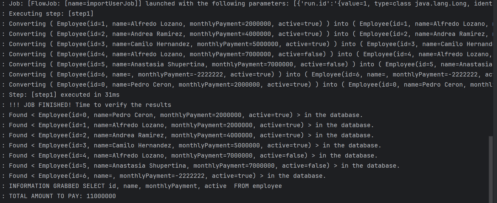

# spreadsheetprocessor

**📝CONTEXT**

a spreadsheet processor must be created. The class must implement
a method(totalAmountToPay) for obtaining the total amount payable for a payroll.
The ProcessPlayer class must have a dependency on a
ProveedorMembersPlanilla(JdbcTemplate) (external dependency) to get the list of employees. When
employees are obtained from the payroll, 

the processor must add the monthly payment of each
employee if this is active and return the total as a result.

Structure of the employee:
• ID (integer)
• Name (string)
• MontoMensual (float)
• Active (bool)

to process spreadsheet with the following validations

1. Monthly payment is negative.
2. Id is zero.
3. Name is Empty.
4. Inactive employee.

✨**SOLUTION PROPOSAL**

A job batch created to process a csv file with the data of many employees to store in a memory database(H2)
then, A method is implemented to get through validations to
the total amount of payments.
🔎

🚧**PROJECT STRUCTURE**
* 📦️configuration
* *  📝  BatchConfiguration.class
* *  📝  BeanConfiguration.class
* *  📝 JobCompletionNotificationListener.class
* 📦️domain
* *  📝  Employee.class
* 📦️processor
* *  📝  EmployeeItemProcessor.class
* 📦️usecase
* *  📝  ProcesadorPlanillas.class
* 📦️util
* *  📝  EmployeeRowMapper.class

🔧**TECHNOLOGIES IN USAGE**
* Spring batch.
* Junit 5.
* Lombok.
* JDK 17.
* H2.

🚀 **SETUP**

To run this project configure your local jdk and gradle, then play the SpreadsheetprocessorApplication.class
to boot up the application and look out the logs for the information.
